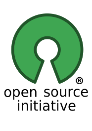
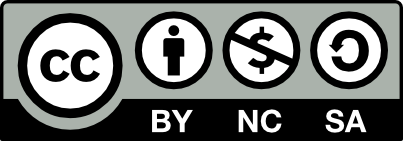

==========================================
 Session 1- Introduction to Free Software
==========================================
Time: 1 hour

- Free software- Definition, Origins and History. (10 mts)
- People in free software. (10 mts)
- Difference between the terms opensource and free software. (10 mts)
- Various organizations involved in promotion of Free and Opensource software (10 mts)
- Popular Free Software Licenses: (GPL,AGPL,FDL,MIT,BSD, Apache licenses etc) (10 mts)

Definition of free software, origins and history.
=================================================
Time : 10 mts

**Free software** is computer software distributed under terms that allow users to **run** the software for any purpose as well as to **study,change, and distribute it and any modified versions**. The freedom provided is often known as the four freedoms in free software.

* The freedom to run the program as you wish, for any purpose (freedom 0).
* The freedom to study how the program works, and change it so it does your computing as you wish (freedom 1). Access to the source code is a precondition for  this.
* The freedom to redistribute copies so you can help others (freedom 2).
* The freedom to distribute copies of your modified versions to others (freedom 3). By doing this you can give the whole community a chance to benefit from your changes. Access to the source code is a precondition for this.

In free software, the source code (human readable form as written by the programmer) is readable and modified to use and distributed; whereas in proprietarty software, these rights are denied, and the user is provided only a machine readable format of the software(machine code), which can only be run/executed.

**Free software is a matter or liberty, not price**: users and computer programmers are free to do what they want with their copies of free software but by preserving the freedom granted.

See Video Link

https://commons.wikimedia.org/wiki/File:Free_software,_free_society-_Richard_Stallman_at_TEDxGeneva_2014.webm

Software was not considered copyrightable before the 1974 US Commission on New Technological Uses of Copyrighted Works (CONTU) decided software programs as a subject matter of copyright. This decision and the case ruling of Apple Computer.Inc vs Franklin Computer Corp in 1983 which held that a computer's operating system could be protected by copyright. As an impact of this, binary code ,the machine readable form of software, was copyrightable too in addition to the human-readable source code. 

Then general trend began to no longer distribute source code, and only distribute machine code. Richard Stallman who was working at MIT at that time was concerned that he could no longer study or modify programs initially written by others and found that this practice was ethically wrong.
To counter this, he founded the **GNU** project to create a UNIX-like OS in 1983. He later founded the **Free Software Foundation** in **October 4 1985**.

   The GNU Logo	    

.. figure:: fsf.png

   The FSF Logo

In 1989, the first version of GNU GPL was published.The GNU project's kernel, later called GNU/Hurd was continually delayed, but most other components like GCC,GDB, and GNU Emacs were completed by 1991.

At that time, a finnish student Linus Torwarlds developed the Linux kernel in 1991 and released the kernel as freely modifiable source code and the project was licensed as GPL in 1992.

	   
   Tux: The Linux Logo
	    
The combination of the GNU operating system and the Linux kernel made the first complete free software operating system later to be called GNU/Linux. The Debian GNU/Linux begun by Ian Murdock in 1993, is noteworthy for being explicitly committed to free software.

   **A desktop running Debian GNU/Linux OS with xfce Desktop environment**	    

There are some animated videos from FSF that will give you a better understanding of the importance of free software.
These videos are hosted on Peertube, a free and decentralized replacement to YouTube. See the following link

https://framatube.org/videos/watch/43af45ec-d99a-4e36-a084-e8e1ce28dee8

<iframe src="https://static.fsf.org/nosvn/videos/fsf-rewind/" id="fsf-rewind-video" scrolling="no" style="overflow: hidden; margin: 0; border: 0 none; display: block; width: 100%; height: 67vw; max-height: 550px;"></iframe>

Another video of this kind from the FSF named "The University of Costumed Heroes".
Video Link hosted on Peertube : https://framatube.org/videos/watch/32ded243-ea5f-4f69-8dd0-5628c9231379

Free Software are used for commercial purposes. Many widely used free software commercial software uses a technical support business model. 

You should be aware of what exactly the term **proprietary software** means. There are also other terms like **freeware** and **shareware** that you should be aware of.

**Proprietary software** or **non-free** software also known as **closed source** software doesnt give user freedoms to modify or reuse and distribute; the source code is often not provided. This kind of software can allow eavesdropping of data usage like even collecting and sending user information without their knowledge. Some proprietary software are privded as **freeware** and **shareware**.
Proprietary software promotes vendor-lockin which leads to monopoly.
The Microsoft EULA is an example of proprietary license.
eg: Microsoft Windows operating system, Microsoft Office, Mac OS, Oracle DB, Oracle Java, Adobe Photoshop, Skype, Google Search/Google Map.

**Freeware** is any software that can be distributed at no cost. This should not be confused with Free Software. Freeware are mostly proprietary, though some are distributed as free software also.Some freeware products are released alongside paid versions ie, there would be two versions - one paid version and the other a zero cost version but with limited features. This approach is known as **freemium** ("free" + "premium") since the free version is intended to promote the premium version.

**Shareware** is a type of proprietary software which is initially provided free of charge to users who are allowed and encouraged to make and share copies of the program. Shareware is often offered as a download from website or on a CD/DVD included with technology magazines.

People in FOSS
==============

- **Richard Stallman**
  Founder of the free software movement, the GNU project and FSF.
  His major contributions include the GNU Emacs and the GNU General Public License) GPL.

  
- **Linus Torwarlds**
  The man behind the Linux kernel which is widely used in all GNU/Linux distribution.

- **Eric Raymond** (Open Source Initiative)

  He wrote the famous book: Cathedral and Bazaar. Eric founded the OSI(Open Source Initiative)

  
- **Ian Murdock**
  The man behind the Debian GNU/Linux Operating System
  which is known as the universal operating system and is widely used
  GNU/Linux Server OS, is well known for its stability and strict adherence to free software guidelines.

   Photo of Ian Murdock- Attribute: "Ilya Schurov, Computerra Weekly"	    
   
- **Mark Shuttleworth**
  The Ubuntu GNU/Linux operating system was founded by him and is developed and maintained by his company named Canonical Inc.
  
- **Aaron Swartz**
  The famous internet programmer and the master mind behind various projects like the web feed format RSS, the markdown publishing format. He was invloved in development for Creative Commons. His other contributions include the OpenLibrary, web2py, DeadDrop(SecureDrop), Demand Progress and Tor2web.

	   
  
- **Lawrence Lessig**: He founded the Creative Commons, the organization which creates and promotes various licenses for sharing and reusing contents from the web which includes text,images and video.

  
- **Larry Wall** (PERL)
  The PERL programming language is widely known for its support for regular expressions and support for string manipulation. It was the programmer's choice for many years and many major programs like KOHA, Duckduckgo widely uses PERL.
  
- **Guido van Rossum** (Python)
  The Python programming language has been around for years and has emerged out to be hottest technology of these days with
  many software libraries for Data Analyitcs, AI and Machine Learning being widely developed in Python.
  
- **Rasmus Lerdoff** (PHP)
  The PHP Programming Language was founded by Rasmus Lerdoff. PHP is known for its simplicity and has been widely accepted by programmers
  The LAMPP platform widely promoted this and many popular frameworks for development and content management are created with PHP.

  \framebreak
  
Difference between the terms free software and opensource
=========================================================

Stallman and the FSF chose the term free software to highlight the idea of freedom in the use and development of software. The term opensource came when Mr Eric S Raymond, a free software developer and advocate wrote *The Cathedral and Bazaar*, which compares two development models: Cathedral which refers to sharing the source code between an exclusive group of developers and the Bazaar model in which code is developed publicly over the internet. Some free software enthusiasts(Raymond,Linus Torvarlds and others) tried a new way to promote free software by rebranding the term by chosing the term "open source" with the hope that it would better reflect the business value of a collaborative, community development model. The **Open Source Initiative(OSI)** was founded by **Raymond** and **Bruce Perens**.

   Logo of Opensource Initiative	    

The Open Source Definition was developed by the OSI which includes the following ten principles:

1. Free Redistribution
2. Source Code
3. Derived Works
4. Integrity of the Author's Source Code
5. No Discrimination Against Persons or Groups    
6. No Discrimination Against Fields of Endeavor
7. Distribution of License
8. License must not be specific to a product
9. License must not restrict other software
10. License must be technology-neutral

See https://opensource.org/osd-annotated for detailed information about opensource definition.

The difference between "free software" and "opensource" is negligible for most people since it comes from different approaches in philosophy. **Hence both these terms are widely used interchangeably**. Though there are differences, the common motive is to make the society understandable in the risks of proprietary software.

FSF mentions in detail **why opensource misses the point of free software** in its article https://www.gnu.org/philosophy/open-source-misses-the-point.html in which it mentions that *"All existing released free software source code would qualify as open source. Nearly all open source software is free software, but there are exceptions. First, some open source licenses are too restrictive, so they do not qualify as free licenses. For example, “Open Watcom” is nonfree because its license does not allow making a modified version and using it privately. Fortunately, few programs use such licenses. Second, when a program's source code carries a weak license, one without copyleft, its executables can carry additional nonfree conditions. Microsoft does this with Visual Studio Code, for example."*.

Later on some movements were made to get the free software and opensource community together. Among these were some people suggesting to use the
terms Free and Open Source Software (FOSS) and another term Free/Libre and Open Source Software(FLOSS).

Major Organizations involved in the promotion of free and opensource software
-----------------------------------------------------------------------------

- **Free Software Foundation**::
    The FSF is a non profit organization founded by Richard Stallman in 1985 October 4, and is the first and major organization that promotes free software.The organization is based in Boston, Massachusetts, US.

    

John Sullivan is the current executive directive. The major projects of FSF includes the GNU Project, the GNU Licenses, maintaining the Free Software Directory, the h-node hardware catalog. The operating systems approved by FSF includes Trisquel, Parabola,PureOS, Debian main.
    The FSF maintains a respect your freedom(RYF) hardware endorsement program. Libreboot and Coreboot are endorsed as part of the FreeBIOS project
    as a replacement to the legacy BIOS and the restricted UEFI based booting systems. Organization Website: https://www.fsf.org/ 
    
- **Software Freedom Conservancy**::
    Software Freedom Conservancy is a not-for-profit charity that helps promote, improve, develop, and defend Free, Libre, and Open Source Software (FLOSS) projects.

	    

Conservancy provides a non-profit home and infrastructure for FLOSS projects. This allows FLOSS developers to focus on what they do best — writing and improving FLOSS for the general public — while Conservancy takes care of the projects' needs that do not relate directly to software development and documentation.

- **Creative Commons**::
    This organization has created a number of licenses and public domain tools that are suitable for creative works which include text, images , music and video. The organization was founded by Lawrence Lessig and pals in 2001. Aron Swartz was one of the initial contributors of Creative Commons.

    

   Creative Commons Logo
    

    Creative Commons is a non-profit organization that helps overcome legal challenges in the sharing of knowledge and creative contents. CCSearch tool developed by Creative Commons to easily discover CC licensed contents over web. Creative Commons organized the CC Summit, an annual event that brings together an international group of educators, artists, technologists, legal experts, and activists to promote the power of open licensing and global access. See the link https://creativecommons.org/about/ to know more about the services offered by Creative Commons.
      
- **Electronic Frontier Foundation**::
   The EFF is an international digital rights group to promote internet civil liberties. It was founded in 1990 in a response to basic threat to speech and privacy.

	   
::
   Major projects of EFF include HTTPS Everywhere, Privacy Badger, Certbot, PanoptClick, Surveillance Self Defence guide. See https://www.eff.org for details
       
- **Digital Freedom Foundation**::
   Digital Freedom Foundation (DFF) is a non-profit organisation that acts as the official organiser of Software, Hardware, and other Freedom Days, and is the legal body that handles donations, sponsorship contracts, and accounting. They have made necessary provisions for tax-deduction for donations in free software domain.
   Website: https://digitalfreedomfoundation.org/

    The Digital Freedom Foundation also organizes Freedom Day events.
    
   - Education Freedom Day (third Saturday in January)
   - Document Freedom Day (last Wednesday of March)
   - Hardware Freedom Day (third Saturday in April)
   - Culture Freedom Day (third Saturday in May)
   - Software Freedom Day (third Saturday in September)

   https://dff.org.in/ is the organization's website in India founded by Krishnakanth Mane. His major work include the GNUKhata Accounting application.

     
- **Open Source Initiative**::
    The OSI was founded in 1998 by Bruce Perence and Eric Raymond. Major contributions includes the Open Source Definition and has worked in creating awareness in opensource. The group adopted the Open Source Definition for open-source software, based on the Debian Free Software Guidelines.
    See website https://opensource.org  for details.
  
- **Software Freedom Law Centre**::
    The Software Freedom Law Center (SFLC) is a tax excempt organization that provides legal representation and related services to not-for-profit developers of free software/open source software in a professional way without payment. It was launched in February 2005 with **Eben Moglen** as chairman. SFLC works include patent defence and has voluntarily filed petitions for protection of free software licenses. SFLC also provides public education, consulting and training to attorneys interested in FOSS Legal issues. Th lawsuit filed by the FSF against Cisco in 2008 was done by the support of SFLC. The services offered can be studied in detail from their website https://softwarefreedom.org/services/ . 

- **The Linux Foundation**::
    Founded in 2000, the Linux Foundation provides unparalleled support for open source communities through financial and intellectual resources, infrastructure, services, events, and training.

    

	   
    
The Linux Foundation (LF) is a non-profit technology consortium created as a merger between Open Source Development Labs and the Free Standards Group to standardize Linux, support its growth, and promote its commercial adoption. It also hosts and promotes the collaborative development of open source software projects. Major projects hosted and supported includes the Linux kernel, Hyperledger, Kubernetes, Nodejs, Tizen, Xen project. The website https://www.linuxfoundation.org  gives more details.
  
- **ICFOSS**::
    ICFOSS (International Centre for Free and Open Source) is a Govt of Kerala organization in India founded in 2009.ICFOSS today carries out a number of FOSS-related activities in a model that brings together Academia, Industry, Government and the FOSS Community. Activities of ICFOSS presently includes R & D; Support to FOSS software development; FOSS Pilot Programs; technology assistance to Government programs and institutions; Local Language computing; Student FOSS activities; Internet Governance; Studies on FOSS; Exploring FOSS Certification; and Capacity Building of students to enter the FOSS Community. 
  
- **Software in the Public Interest**::
    Software in the Public Interest (SPI) is a non-profit corporation registered in the state of New York founded to act as a fiscal sponsor for organizations that develop open source software and hardware.

   SPI Logo	    

   The mission is to help substantial and significant open source projects by handling their non-technical administrative tasks so that they aren't required to operate their own legal entity. Founded in 1997, SPI was initially involved in the funding of Debian projects. Other major projects associated with SPI include Arch Linux,LibreOffice, Postgresql and Swatantra Malayalam Computing. Details of the SPI associated projects can be studied from https://www.spi-inc.org/projects/ . 
    
- **Apache Software Foundation**::
    The Apache Software Foundation is an American non-profit organization founded in 1999. The ASF is the organization behind the popular Apache web server and the famous Apache license.

   The Logo of Apache Software Foundation - Licensed by Apache 2.0	    
    
    The Apache Software Foundation provides support for 300+ Apache Projects and their Communities, furthering its mission of providing Open Source software for the public good. The ASF develops, and incubates hundreds of freely-available, enterprise-grade projects that serve as the backbone for some of the most visible and widely used applications in computing today. The ASF creates and maintains applications in Artificial Intelligence and Deep Learning, Big Data, Build Management, Cloud Computing, Content Management, DevOps, IoT and Edge Computing, Mobile, Servers, and Web Frameworks. The ASF organizes yearly conferences also.
    See https://apache.org/ for more details about the organization.
    
- **OpenStreetmap Foundation**::
    The OpenStreetMap Foundation is a non-profit foundation founded in 2006 whose aim is to support and enable the development of freely-reusable geospatial data.

   Logo of the OpenStreetmap Project

    The OpenStreetMap Project based at OpenStreetMap.org, is the worldwide mapping effort that includes over two million volunteers around the globe. OpenStreetMap (OSM) is a collaborative project to create a free editable map of the world. The geodata underlying the map is considered the primary output of the project. The creation and growth of OSM has been motivated by restrictions on use or availability of map data across much of the world, and the advent of inexpensive portable satellite navigation devices and was developed as a free software replacement to GoogleMaps.
    See https://www.openstreetmap.org/ and https://wiki.osmfoundation.org/wiki/Main_Page

- **Open Knowledge Foundation (OKF)**::
    The OKF is a global non-profit network that promotes and shares information at no charge, including both content and data. It was founded by Rufus Pollock in May 2004.
    

   The Open Knowledge Foundation Logo: License: CC BY 4.0
	    
    It organises the OKCon and supports the International Open Data Day to promote the idea of open knowledge and open data. The projects of OKN include CKAN- a tool that provides store for metadata. This enables governments to quickly and cheaply provide a catalogue of their data.Other major activities include DataHub, OpenBibliography, OpenEconomics and OpenGLAM. See the link http://okfn.org/ to study more about OKF and its activities.
  

Popular Free Software Licenses
==============================
     
- **Protective License (CopyLeft)**::
   The free-software share-alike licenses written by Richard Stallman in the mid-1980s pioneered a concept known as "copyleft".

   The Symbol of CopyLeft
   
Ensuing copyleft provisions stated that when modified versions of free software are distributed, they must be distributed under the same terms as the original software. This results in the new software being free software(free as in freedom not zero price) as well. Since copyleft ensures that later generations of the software grant the freedom to modify the code, this is "free software". Study more about this in the link: https://www.gnu.org/licenses/copyleft.en.html
   eg: GNU GPL, GNU AGPL, GNU LGPL, GNU FDL.

   The strength of the copyleft license governing a work is determined by the extent its provisions can be imposed on all kinds of derived works.
   
  - **Weakly Protective**: The term "weak copyleft" refers to licenses where not all derived works inherit the copyleft license; whether a derived work inherits or not often depends on how it was derived. "Weak copyleft" licenses are often used to create software libraries. This allows other software to link to the library and be redistributed without the requirement for the linking software to also be copyleft-licensed. Only changes to the weak-copyleft-licensed software itself become subject to copyleft provisions of such a license. This allows programs of any license to be compiled and linked against copylefted libraries such as glibc and then redistributed without any re-licensing required. eg: **GNU LGPL** (Lesser General Public License), Mozilla Public License(**MPL**).

  - **Strongly Protective**: The most well-known free-software license using strong copyleft is the GNU General Public License(**GPL**). A stronger copyleft license is the **AGPL**, which requires the publishing of the source code for SaaS, eg when deployed in servers. Another example of strong copyleft license is the **Design Science License** created by Michael Stutz ; it can apply to any work, not only software or documentation, but also literature, artworks, music, photography and video.

.. figure:: GPL3-logo.png

   Logo of the latest version GNU GPL v3

   Logo of the Affero General Public License v3	    
    
- **Permissive License** ::
    Permissive free software licenses allow use rights including right to relicense the work. Examples of licenses in this category include the **GNU All Permissive License**, **MIT License**, **BSD Licenses**, **Apache License** and **Software in Public Domain**.
    
    However, there are some licenses under this category which allows proprietarization and these licenses are to be carefully looked into.

**License Compatibility Matrix** : License compatibility between common FOSS software licenses according to David A. Wheeler (2007): the vector arrows denote a one directional compatibility, therefore better compatibility on the left side ("permissive licenses") than on the right side ("copyleft licenses").
    

Software Licenses
-----------------
 
Licenses for software that comply to terms of the FSF includes the GPL v3,GPL v2, GNU LGPL, GNU AGPL, GNU AllPermissive License,
Apache License v2, Modified BSD License, FreeBSD License, Intel Open source License, Mozilla Public License 2.0, Public Domain License, X11 license.

**GNU GPL v3**: This is the latest version of the GNU GPL: a free software license, and a copyleft license. It is recommended for most software pachages.

**GNU LGPL v3**: This is the latest version of the LGPL: a free software license, but not a strong copyleft license, because it permits linking with nonfree modules. It is compatible with GPLv3.

**GNU Affero General Public License (AGPL) version 3** : GNU AGPL is a free software license which can be used for any software which will commonly be run over a network.

**Software in Public Domain** :  Being in the public domain is not a license; rather, it means the material is not copyrighted and no license is needed. Practically speaking, though, if a work is in the public domain, it might as well have an all-permissive non-copyleft free software license. Public domain material is compatible with the GNU GPL. Popular tool like CCZero can be used to develop works in public domain which allows freeing content globally without restrictions. Works licensed in CC0 doesnt require attribution(acknowledgement as credit to the copyright holder or author of a work), allows commercial use and meets the OKF Open Definition

.. image:: cc-zero.png

See https://www.gnu.org/licenses/license-list.en.html for more details.

Documentation Licenses
----------------------

There are separate licenses for documentation works.

- **GNU FDL**: This is a license intended for use on copylefted free documentation. It is adopted for GNU Manuals and other kinds of useful works such as textbooks and dictionaries.
  
- **FreeBSD Documentation License**: This is a permissive non-copyleft free documentation license that is compatible with the GNU FDL.

Other free documentation licenses are **Apple's Common Documentation License v1.0** and **Open Publication License v1.0** . 

License for Other Works
-----------------------

There are separate licenses for works of practical uses other than software/documentation, license for fonts, license for works stating  a viewpoint, and license for designs of physical objects.

The GNU GPL can also be used for general data which is not software, as long as one can determine what the definition of “source code” refers to in the particular case. The GNU FDL also is recommended for textbooks and teaching materials for all topics.

- **CC0**:  The CC Zero License is a public domain dedication from Creative Commons. Both public domain works and the lax license provided by CC0 are compatible with the GNU GPL. 
  
- **Creative Commons Attribution 4.0 License (CC-BY)** : This is a non-copyleft free license that is good for art and entertainment works, and educational works. 
  
- **GNU Verbatim Copying License** : For Works that express someone's opinion—memoirs, editorials this license is suitable to use. This was the license used throughout the GNU web site for many years. It is very simple, and especially well-suited to written works. 
  
- **Creative Commons Attribution-NoDerivs 4.0 license (a.k.a. CC BY-ND)** : This is the license used throughout the GNU and FSF web sites. This license provides much the same permissions as our verbatim copying license, but it's much more detailed. It is particularly recommended for audio and/or video works of opinion.

.. figure:: cc-by.png

   CC-BY Permits reuser to distribute, remix, adapt, and build upon in any medium/format, allows commercial use, attribution(credit) must be given to the creator

.. figure:: cc-by-sa.png 

   CC-BY-SA License permits the same terms and condition as CC-BY with a restriction(SA-Share Alike) that adaptations must be shared under the same terms.

.. figure:: cc-by-nc.png

   CC-BY-NC license permits the same terms as CC-BY but no commercial use is permitted.

   CC-BY-NC-SA permits the same terms as given by CC-BY-NC with the restriction of Share Alike(SA) ie derivates should be shared under the same terms.

.. figure:: cc-by-nd.png

   CC-BY-ND allows reusers to copy and distribute the material in any medium or format in unadapted form only.attribution should be given.Commercial use allowed.

.. figure:: cc-by-nc-nd.png

   CC-BY-NC-ND allows the same terms as CC-BY-ND but with no commercial use allowed.
	
.. figure:: cc-zero.png

   CC-Zero allows reusers to distribute, remix, adapt, and build upon the material in any medium or format, with no conditions.

Other licenses in this category include the Creative Commons Attribution-Sharealike 4.0 license (a.k.a. CC BY-SA), the Design Science License, Free Art License, Open Data License.

Fonts can be licensed with the free software licenses: GNU GPL, Arphic Public License.

Free Software Licenses for designs of physical objects like circuit designs and 3D Printer plans includes the GNU GPL v3, CC-BY, CC-BY-SA, or CC0.

Video Link https://commons.wikimedia.org/wiki/File:Creative_Commons_Licenses_for_Non-Profit_Organizations.webm

https://creativecommons.org/about/videos/

See the link https://www.gnu.org/licenses/gpl-faq.html for a detailed study.

Other links related to free software license:

https://www.fsf.org/licensing/

https://en.wikipedia.org/wiki/Comparison_of_free_and_open-source_software_licences

https://en.wikipedia.org/wiki/Free-software_license

----

> Content Version 1.0 prepared by Tanzeem M B, Programmer, Informatics Division, C-DIT
date 18 Nov 2020.
Update: 27/11/2020
Final update: 01/12/2020

