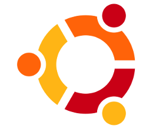

===========================================
 Session 2- Free Software Operating Systems
===========================================
Time: 1 hour 35 mts

-  Major GNU/Linux Oses Debian,Ubuntu,CentOS/RedHat - Introduction and differences   (15mts)
- Other GNU OS: FreeBSD,OpenBSD,Gentoo,Arch
- The Linux Terminal - Commands for directory and file manipulation,
   mc-midnight commander terminal based file manager.
   The commandline shell: Bash,zsh.
   Basic network commands like ftp,scp,lynx,wget,curl. Terminal editers pico, nano. Using Terminal multiplexers.   (20 mts)
- GNU Emacs (20 mts)
- Vi  (10 mts)
- Desktop Enivronments - GNOME, KDE, Cinnamon, Mate, XFCE/LXDE
  (demo videos and images)
  (15 mts)

GNU/Linux Operating System
==========================
Time : 15 mts

This session focuses on various GNU/Linux operating systems.

Debian GNU/Linux
----------------

Among the popular operating systems is the Debian GNU/Linux operating system also known as the universal operating system.
Debian is a widely preferred server operating system.
Debian was begun in August 1993 by Ian Murdock. Debian systems currently use the Linux kernel or the FreeBSD kernel.

   The Debian Logo
   
To get Debian, visit the link: https://www.debian.org/distrib/

The codenames used in naming a Debian release is based on the characters of Toy Story.
Debian 10 is codenamed Buster and Debian 11 is codenamed BullsEye.
Every test release of Debian is codenamed sid.

The Debian project is developed over the internet by a community of volunteers in their free time lead by a Debian project leader
and following a Debian constituition, the Debian Free Software Guidelines (DFSG) and the Debian Social Contract.

The Debian project was initially ffunded by the FSF and later on by the SPI(Software in Public Interest), formed by the Debian project.
Debian project comes with over 59000 packages((precompiled software that is bundled up in a nice format for easy installation on your machine).

**Package Manager used**: **APT(Advanced Packaging Tool)**

**Package format**: **.deb**

**Default File System**: **ext4**

**Default init system**: **systemd**

**Official Website** : https://www.debian.org/

**Mailing list**: lists.debian.org

**IRC**: #debian channel at irc.debian.org

**FSF recommendation**: **Partial** - Debian GNU/Linux is recommended by FSF if its main repository only is enabled. 

The major reasons why people choose Debian are:

- Debian is complete free software (it supports non-free systems by enabling the non-free repo in settings)
- Debian is a stable and secure linux operating system
- Debian has extensive hardware support
- Debian provides smooth upgrades
- Debian is the seed and base for many other distributions.
  Many of the most popular Linux distributions, like Ubuntu, Knoppix, PureOS, SteamOS or Tails, choose Debian as a base.
- The Debian project is a community.
  Debian is not only a Linux operating system. The software is co-produced by hundreds of volunteers from all over the world. Anyone can be part of the Debian community even if he/she is not a programmer or sysadmin. Debian is community and consensus driven and has a democratic governance structure. Since all Debian developers have equal rights it cannot be controlled by a single company. 

IoT and embedded devices supported by Debian include Raspberry Pi, variants of QNAP, mobile devices, home routers and a lot of Single Board Computers (SBC).

Debian supports multiple hardware architectures including amd64, i386, multiple versions of ARM and MIPS, RISC-V.

Debian GNU/Linux has support for all the available desktop environments - KDE, GNOME, LxQT/LXDE, MATE, XFCE

Debian Pure Blends
^^^^^^^^^^^^^^^^^^

A Debian pure blend is a project completely inside Debian which aims to suit specialized needs with a common goal to simplify the installation and administration of computers for their target audience. Debian pure blends are available for lawyers, children, medical staff, scientists, gamers, visually impaired people etc.

Examples: Debian Edu, Debian Junior, Debian Med, Debian Multimedia, Debian Games, Debian Science, Freedombox.

For more details and to download Debian Pure blends see link https://www.debian.org/blends/ 

Ubuntu GNU/Linux Operating System
=================================

Ubuntu is developed by Canonical and a community of other developers, under a meritocratic governance model.
Ubuntu was first released on 20 October 2004 .
Ubuntu is derived from Debian GNU/Linux.
Founder: Mark Shuttleworth, owner of Canonical inc.

   Ubuntu Logo

Ubuntu is built on Debian's architecture and infrastructure, and comprises Linux server and desktop.
Officially released in separate editions for Desktop, Server, and Core for IoT/Robots.
New Ubuntu releases are done every six months, with long term support (LTS) releases every two years.
Each Ubuntu release has a version number that consists of the year and month number of the release.
eg: Ubuntu 20.04 LTS is released on year 2020 , month 04 and is an LTS release

Ubuntu variants are available with various desktop environments/ purposes.

- KUbuntu (with KDE default desktop enviroment)
- LUbuntu : runs LXQt (used LXDE earlier) as the default desktop enviroment
- Ubuntu Budgie (runs Budgie default desktop enviroment)
- Ubuntu Kylin : customized for Chinese market
- Ubuntu MATE (runs MATE default desktop enviroment)
- Ubuntu Server : customized for server
- Ubuntu Studio : customized for multimedia creation
- XUbuntu (runs XFCE default desktop enviroment)

**Package Manager used**: **APT(Advanced Packaging Tool)**

**Package format**: **.deb**

**Default File System**: **ext4**

**Default init system**: **systemd**

**FSF recommendation**: **Not recommended** by the FSF. Ubuntu derivative named Trisquel GNU/Linux is recommended by FSF.

Default linux kernel used by Ubuntu is in the form of binary blobs.
A default installation of Ubuntu consists of a wide range of software like LibreOffice, Firefox, Thunderbird, Transmission
and some light-weight games. Other applications of your choice can be installed from the builtin **Ubuntu Software**
as well as many other APT-based package management tools. Cross-distribution **snap** packages and **flatpaks** are also available
that both allow installing software, such as some of Microsoft's software, in most of the major Linux operating systems. 

Launchpad and PPA:
A Personal Package Archive (PPA) is a software repository for uploading source packages to be built and published as an Advanced Packaging Tool (APT) repository by Launchpad (A webapplication/web-site that allows users to develop and maintain software, particularly open source and is maintained by Canonical)

The software being installed by Ubuntu are classifed into the following.
Software classification:
- Free Software/main (canonical supported software domains)
- Free Software/universe( unsupported)
- Non-free software/Restricted (canonical supported software domains)
- Non-free software/multiverse (unsupported)

  
----

> Content Version 1.0 prepared by Tanzeem M B, Programmer, Informatics Division, C-DIT
date: 

